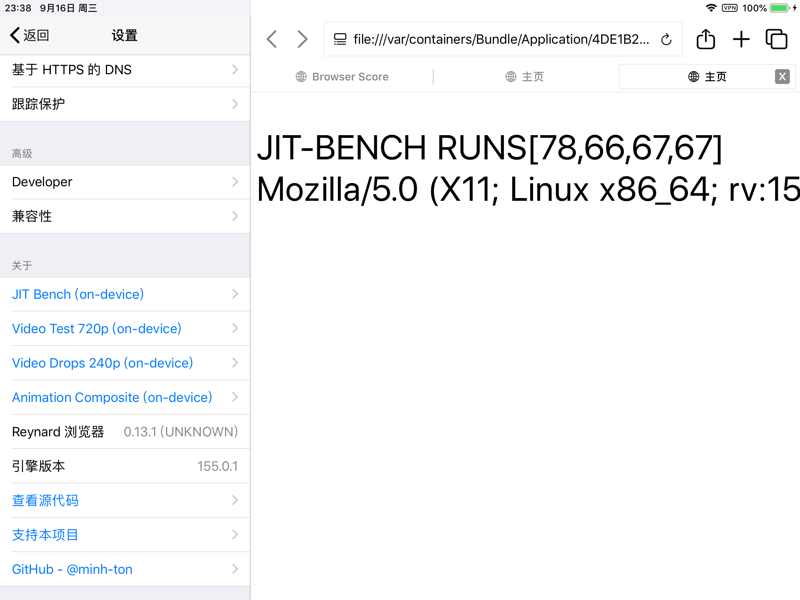
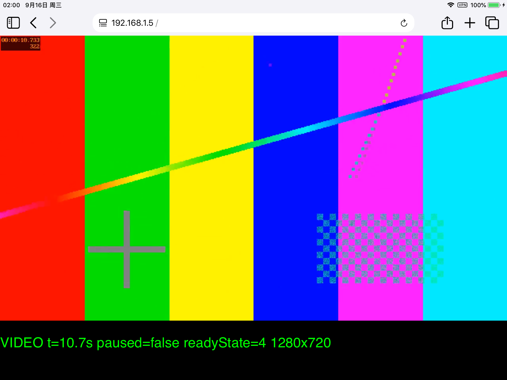
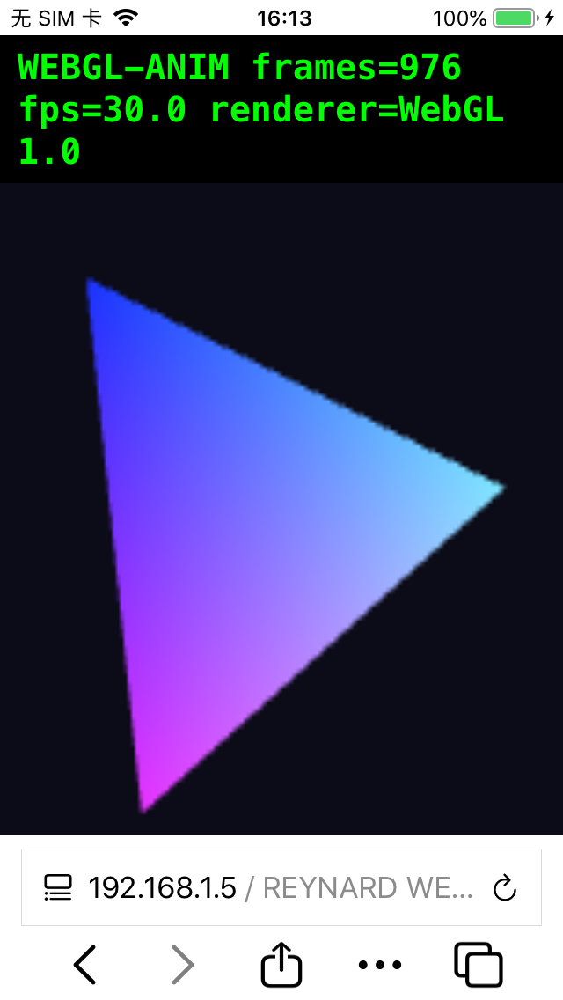
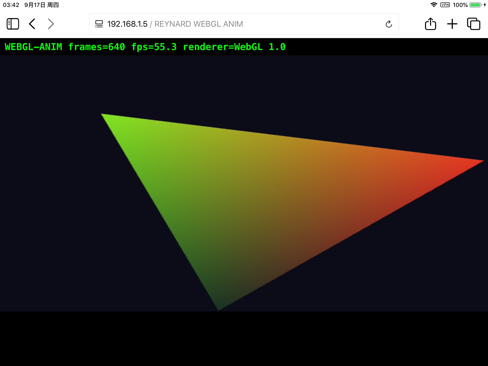

<p align="center">
  
</p>

# Reynard Browser for iOS 12

[English](README.md) | **简体中文**

> [!WARNING]
> 本项目是 [minh-ton/reynard-browser](https://github.com/minh-ton/reynard-browser) 的实验性分支，**仅面向 iOS 12**。这是一个 AI 辅助的复活项目：预期会有 bug、缺失功能和各种毛刺。这些改动没有上游化的计划 —— 它们刻意用代码整洁度换取对一款 2014 年系统的兼容性。

Reynard 是一款基于 **Gecko** 内核的浏览器。iOS 上所有浏览器——包括 Safari——都被强制使用系统自带的 **WebKit**，而 Reynard 自带引擎：就是驱动桌面版和 Android 版 Firefox 的那个 Gecko。

在 iOS 12 上，系统自带的 WebKit 已经落后了十年，大多数现代网站直接打不开。由于 Gecko 被编译进了应用本体，这个移植版可以在 Apple 早已放弃的硬件上加载现代网站。

## 现状

- **现代网页渲染** —— 复杂网站（Google 搜索、GitHub、Web 应用）可以渲染并正常运行 JavaScript。
- **SpiderMonkey JIT 已在主进程启用** —— 本移植为单进程架构，因此 JIT 直接在应用进程内启用（基准测试中 JavaScript 比解释器基线快约 18 倍）。在 AppSync 签名的越狱设备上无需调试器附加或 root 助手。
- **视频播放** —— H.264 播放可用（720p 可放）。解码走 VT 硬解、视频帧零拷贝上屏（硬件叠加层路径，不经过页面合成）；页面其余部分 CPU 合成（SWGL），A7 上高分辨率视频 CPU 开销仍然可观。
- **WebGL 渲染** —— WebGL 1.0 上下文可创建并正常播放动画（已用本机旋转三角探针页验证）。
- **iOS 12 构建目标** —— 包内所有二进制都按 iOS 12.0 构建（`minos 12.0`），iOS 13+ API 调用全部带运行时门禁与回退。本机诊断页（JIT 跑分、视频、动画、WebGL）见「设置 → 高级 → Developer」。

## 截图

以下截图均摄于真机（A7，iOS 12.5.8）：


*JIT 基准测试 —— `RUNS[78,66,67,67]` 的 warmup 形状说明 Ion 已进入稳态（约为解释器基线的 18 倍）。应用内诊断页见设置。*


*720p H.264 测试视频播放中（`readyState=4`，时间戳正常推进）。*

WebGL 探针页（旋转三角，`renderer=WebGL 1.0`）：

| iPhone（30 fps） | iPad（55 fps） |
| --- | --- |
|  |  |

## 环境要求

- **iOS 12.0 – 12.5.x** 的 iPhone/iPad（按 iOS 12.0 构建；实测环境是 A7 设备上的 12.5.8：iPad mini 2 与 iPhone 5s）
- 已**越狱**（checkra1n 可用）
- 从 Cydia/Sileo 安装 [AppSync Unified](https://github.com/akemin-dayo/AppSync)

## 安装

从 [releases 页面](https://github.com/Bemly/firefox-ios12/releases)下载预编译的 `Reynard-Jailbroken.ipa`（tag 形如 `0.14.0-ios12`；上游有动静时定时 CI 会重编），然后：

1. 把 `.ipa` 拷到设备上（iOS 12 没有 AirDrop；用 SSH/Filza/iTunes 文件共享）。
2. 用 [Filza](https://www.tigisoftware.com/default/?page_id=78) 打开并安装，AppSync Unified 会处理签名。
3. 启动（包名 `moe.bemly.reynard`）。JIT 会在启动时自动启用；若无法启用，浏览器会静默回退到解释器。

## 构建

> [!WARNING]
> 构建说明仅供参考，构建问题不提供支持。

需要 Xcode 26、[Python 3](https://www.python.org/downloads/)、带 `aarch64-apple-ios` target 的 [Rust 和 Cargo](https://doc.rust-lang.org/cargo/getting-started/installation.html)，以及 [ldid](https://formulae.brew.sh/formula/ldid)。

克隆仓库。

```bash
git clone --recursive <this-repo-url>
cd reynard-browser-ios12
```

下载 Gecko 并套用本移植的补丁。

```bash
./tools/development/update-gecko.sh
./tools/development/apply-patches.sh
```

构建依赖和 Gecko 引擎（首次构建耗时较长，约 45 分钟）。

```bash
./tools/development/build-idevice.sh
DEVELOPER_DIR=/Applications/Xcode26.app/Contents/Developer ./tools/development/build-gecko.sh
```

然后构建应用本体。没有付费签名证书时，可以先关闭签名构建，再用 `ldid` 重签（主二进制需要 `browser/Reynard/Entitlements/Reynard.private.entitlements` 里的权限声明）：

```bash
xcodebuild build -project browser/Reynard.xcodeproj -scheme Reynard \
  -configuration Debug -sdk iphoneos -arch arm64 \
  CODE_SIGNING_ALLOWED=NO CODE_SIGN_IDENTITY="-" -derivedDataPath /tmp/ReynardDD
ldid -Sbrowser/Reynard/Entitlements/Reynard.private.entitlements \
  /tmp/ReynardDD/Build/Products/Debug-iphoneos/Reynard.app/Reynard
```

Release 包走 `tools/release/build-app.sh --no-signing`（Xcode 26）+ `tools/release/create-ipa.sh --jailbroken`。完整真机联调记录见 `docs/`。

## 说明

上游项目最初的实验目标是在不使用 Apple [BrowserEngineKit](https://developer.apple.com/documentation/browserenginekit) 的前提下运行 Gecko，从而把引擎回移植到旧版 iOS。本分支把这个思路推到了逻辑终点：一台初代 iPad mini 的 A7 芯片上跑着 2025 年的 Gecko 浏览器，引擎的 JIT、媒体管线和 JavaScript 安全门禁都为「单进程、iOS 13 之前」的世界做了调整。

如果你觉得这件事有意思，欢迎贡献和指路 —— 这本身就是一个边学边做的项目。

## 致谢

- [minh-ton/reynard-browser](https://github.com/minh-ton/reynard-browser)：本分支基于的上游 iOS 13+ Gecko 浏览器。
- [LiveContainer](https://github.com/LiveContainer/LiveContainer)：应用扩展处理与 NSExtension 用法。
- [StikDebug](https://github.com/StephenDev0/StikDebug) 与 [idevice](https://github.com/jkcoxson/idevice)：基于配对的 JIT 启用方案。
- [TrollStore](https://github.com/opa334/TrollStore)：root 助手拉起与 JIT 启用技术。
- [Amethyst-iOS](https://github.com/AngelAuraMC/Amethyst-iOS)、[dolphin-ios](https://github.com/OatmealDome/dolphin-ios)、[DukeX](https://github.com/MaftyManicEMU/DukeX)、[MeloNX](https://git.ryujinx.app/projects/MeloNX)：各类工具函数、私有 API 用法与 JIT 内存处理。
- 基于 BrowserEngineKit 把 Gecko 带到 iOS 的[既有工作](https://bugzilla.mozilla.org/show_bug.cgi?id=1882872)：最艰难的引擎集成部分。

## 许可证

本项目以 [GNU General Public License v3.0](LICENSE) 授权，`patches` 目录除外 —— 该目录包含对 Firefox Gecko 引擎的修改，因此遵循 [Mozilla Public License 2.0](LICENSE.firefox)。
